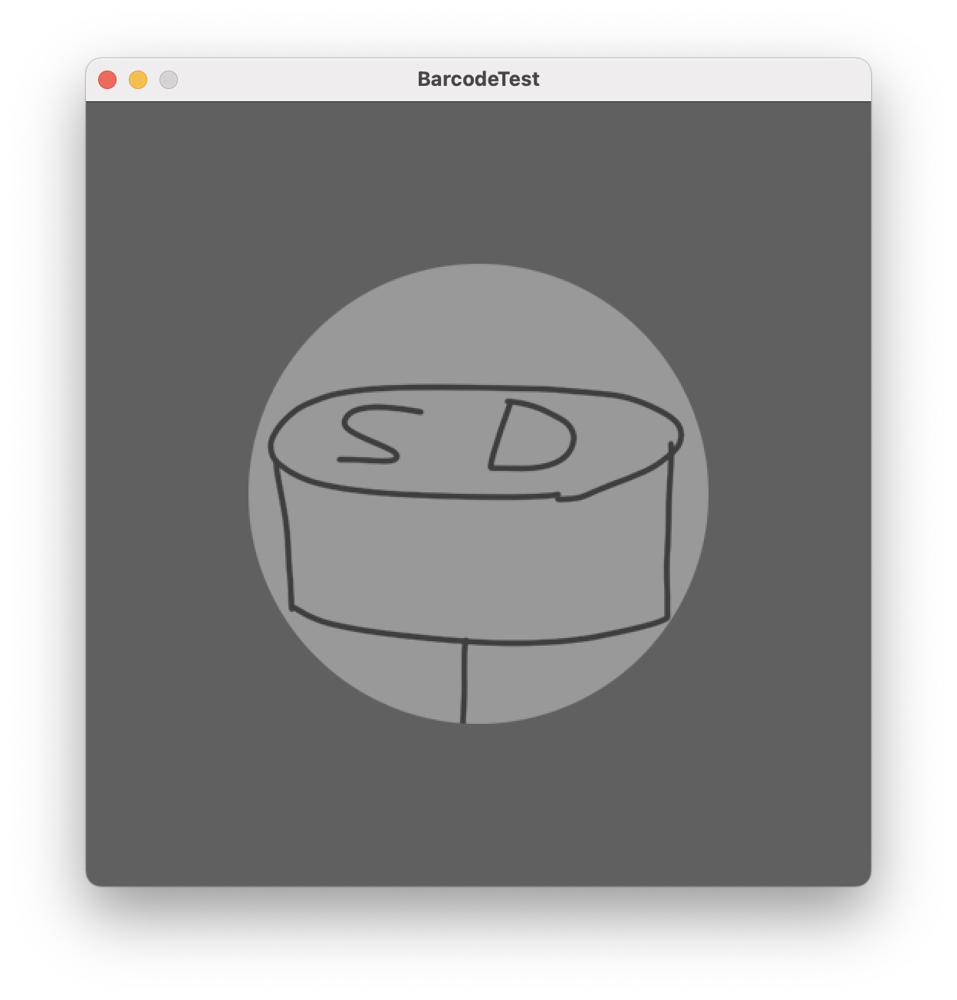
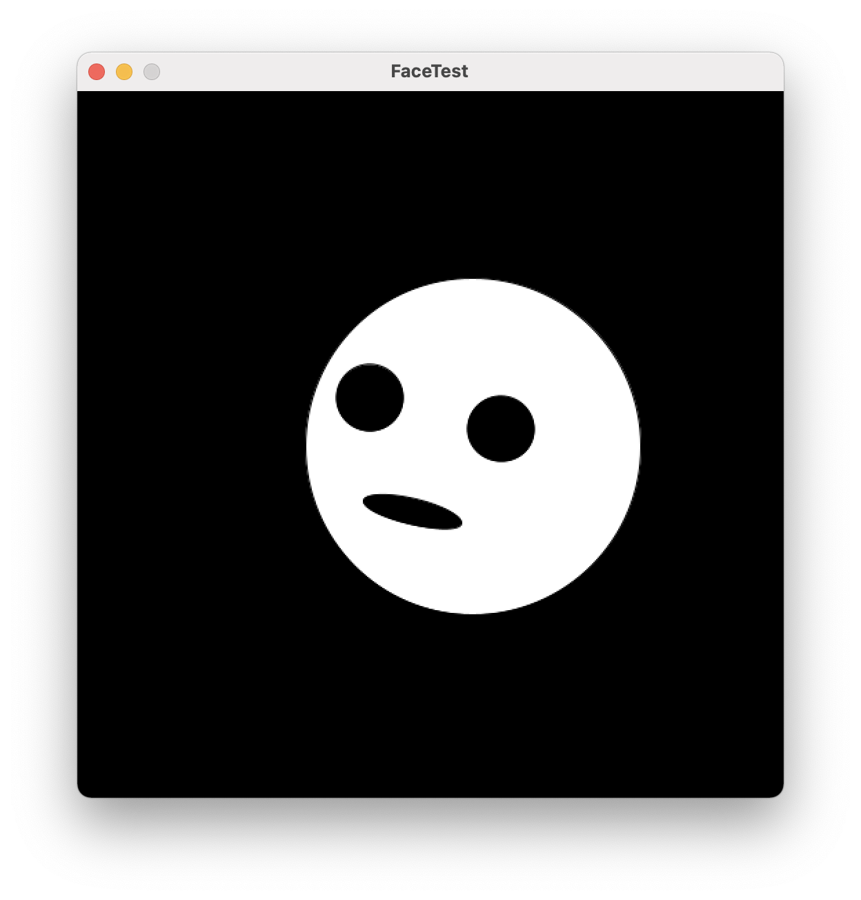
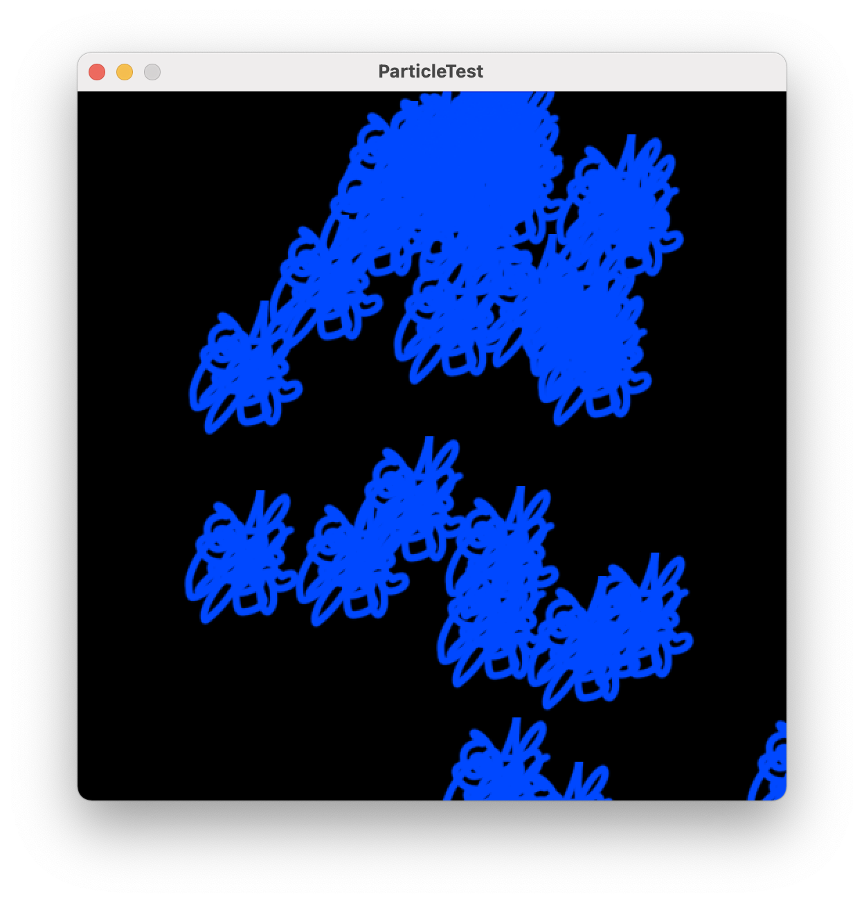
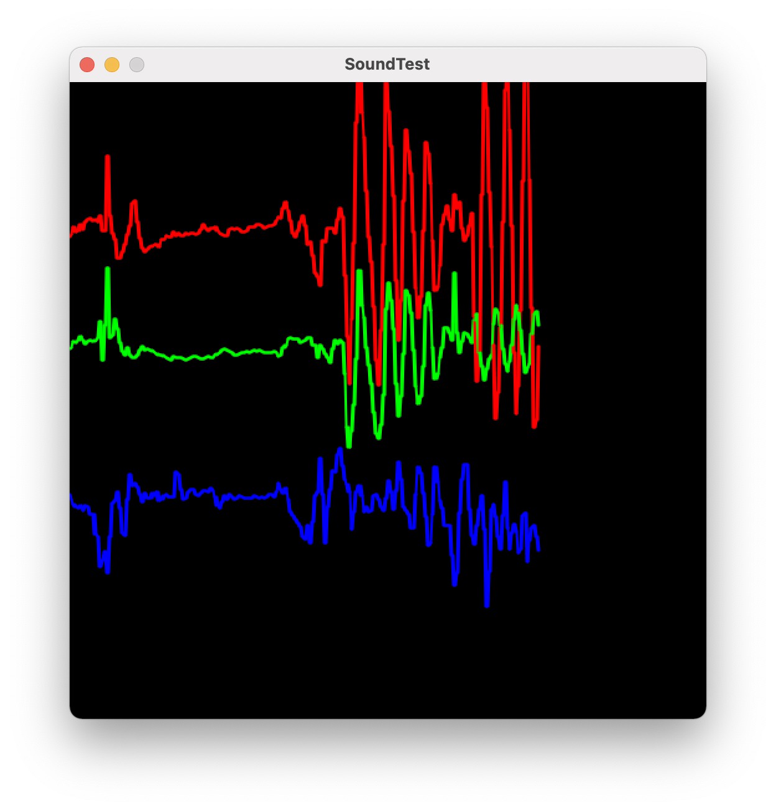

# sensors_receiver

以下のアプリと連動して動作する
https://github.com/5up-okamura/sensors

## BarcodeTest

)

data フォルダの BD.WAV, SD.WAV 以外のサウンドファイルを Sample Sound フォルダに移動しました  
Sample QR code フォルダに QR コードのサンプル画像（QR_BD.png, QR_SD.png）を追加しました

## FaceTest

)

## ParticleTest

)

## SoundTest

)
